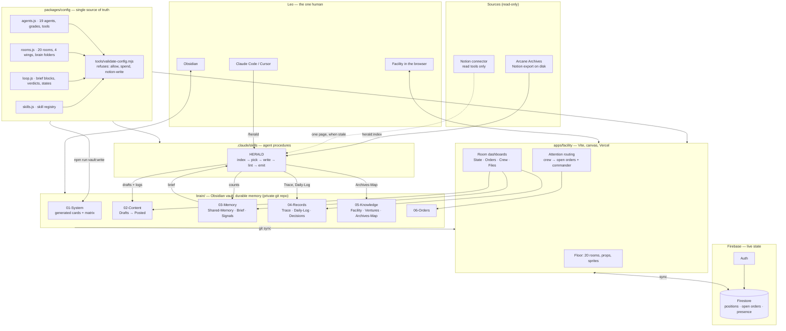
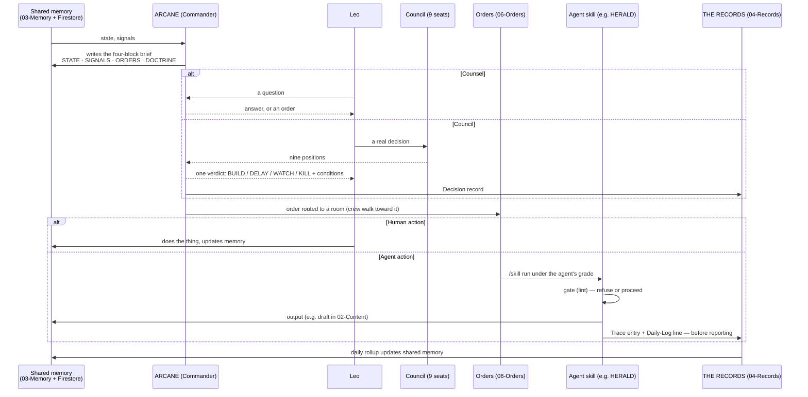

# THE ARCANE — Architecture

One facility, one brain, nineteen agents, one operator. This document is
the map of how the parts connect. The parts themselves are documented
where they live.

## The layers

## The core loop

## Where truth lives

| Question | Answer lives in | Why there |
| --- | --- | --- |
| Who are the agents and what may they do? | `packages/config` | Code the validator can refuse. Everything else is generated from it. |
| What is true right now? | `brain/03-Memory/Shared-Memory.md` (durable) + Firestore (live) | Durable wins on conflict; the facility re-syncs from the vault. |
| What happened? | `brain/04-Records/Trace/` | Append-only. No trace, no run. |
| What was produced? | `brain/02-Content/` | Frontmatter status is the lifecycle; only humans move it. |
| What does the floor look like? | `apps/facility/src/config/floorplan.js` | Geometry and props are presentation; they import meaning from config. |
| What do the Archives contain? | `data/archives/index.json` (regenerable) + `brain/05-Knowledge/Archives-Map.md` | Index is big and derived; the map is small and committed. |

## The permission model, in one paragraph

Seven grades, seven capabilities, nineteen agents, one matrix. `allow`
exists in the vocabulary so the matrix can state that nobody holds it.
`spend` is `deny` everywhere. Notion is `read-only` at the tool level, so
no grade can reach a Notion write. A skill is registered against an agent
and lists the folders it writes; the validator refuses a skill that writes
where its agent's grade does not reach. The Control Room renders the
matrix; the vault prints it; the validator enforces it; the runtime checks
it again before an act. Four places, one source.

## Attention routing (facility)

Each room has an *attention score*: open orders weighted by priority
(P0=8, P1=4, P2=2, P3=1), plus a commander-proximity bonus. Crew choose a
destination by sampling rooms proportional to score, with a strong prior
for their home station and a cooldown so they do not oscillate. Routing is
BFS over the corridor graph. The score is computed from `06-Orders` (via
Firestore mirror) so the floor is a picture of the work, not a screensaver.

## Deployment

- `apps/facility` → Vercel (static build, `VITE_*` public Firebase config).
- `brain/` → its own private GitHub repo (`arcane-brain`), synced by
  Obsidian Git on desktop and read by skills via `ARCANE_BRAIN`. Kept as a
  folder in this monorepo until day 3, then split (`git subtree split`).
- `packages/config` → published to nowhere; imported by path. Vercel builds
  the facility with it; skills import it relative to the repo.
- Firestore rules: authenticated operator only; agents never hold a service
  account in the browser. Server-side reasoning (Counsel/Council) comes
  later behind a Vercel function with `ANTHROPIC_API_KEY`.
