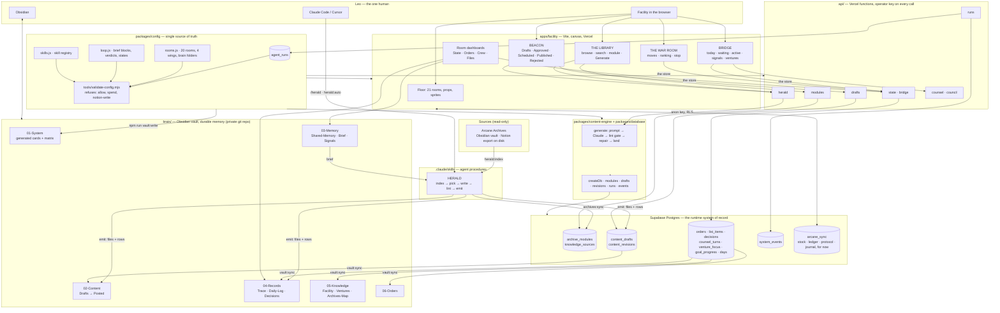
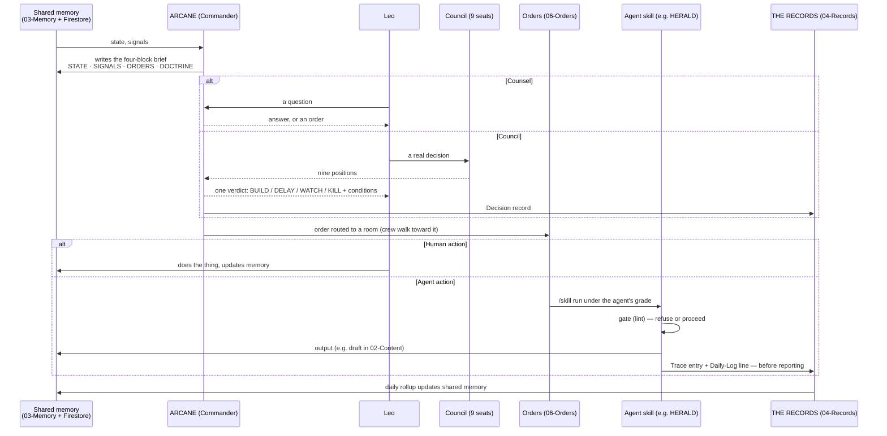

# THE ARCANE — Architecture

One facility, one brain, nineteen agents, one operator. This document is
the map of how the parts connect. The parts themselves are documented
where they live.

## The layers

## The core loop

## Where truth lives

| Question | Answer lives in | Why there |
| --- | --- | --- |
| Who are the agents and what may they do? | `packages/config` | Code the validator can refuse. Everything else is generated from it. |
| What is true right now? | `brain/03-Memory/Shared-Memory.md` (durable) + `arcane_sync` (stock, ledger, protocol, journal — until their rooms are built) | Durable wins on conflict; the facility re-syncs from the vault. |
| What is the floor working on, and what did Leo decide? | `orders`, `list_items`, `decisions`, `counsel_turns`, `venture_focus`, `goal_progress`, `days`; mirrored into `06-Orders`, `05-Knowledge/Lists.md`, `Focus.md`, `04-Records` by `vault:sync` | The rooms write tables through one registry; the Bridge aggregates them; the vault records them. |
| What happened? | `system_events` + `brain/04-Records/Trace/` | Append-only. No trace, no run. |
| What was produced, and where is it in its life? | `content_drafts` / `content_revisions`; mirrored to `brain/02-Content/` by `vault:sync` | The floor decides; the vault records. Only humans move a status; every change is a revision. |
| What did an agent do? | `agent_runs` | Objective, sources, output, usage, error, the device that asked. |
| What does the floor look like? | `apps/facility/src/config/floorplan.js` | Geometry and props are presentation; they import meaning from config. |
| What do the Archives contain? | the Obsidian vault → `data/archives` (regenerable) → `archive_modules` (searchable) | The vault is the source; the index is derived; the table is what the Library reads. |
| Who may call the API? | `ARCANE_OPERATOR_KEY` on the server, pasted once per browser | The site is public; the OS is not. A sync code is identity, not authority. |

## The permission model, in one paragraph

Seven grades, seven capabilities, nineteen agents, one matrix. `allow`
exists in the vocabulary so the matrix can state that nobody holds it.
`spend` is `deny` everywhere. Notion is `read-only` at the tool level, so
no grade can reach a Notion write. A skill is registered against an agent
and lists the folders it writes; the validator refuses a skill that writes
where its agent's grade does not reach. The Control Room renders the
matrix; the vault prints it; the validator enforces it; the runtime checks
it again before an act. Four places, one source.

## Attention routing (facility)

Each room has an *attention score*: open orders weighted by priority
(P0=8, P1=4, P2=2, P3=1), plus a commander-proximity bonus. Crew choose a
destination by sampling rooms proportional to score, with a strong prior
for their home station and a cooldown so they do not oscillate. Routing is
BFS over the corridor graph. The score is computed from `06-Orders` (via
Firestore mirror) so the floor is a picture of the work, not a screensaver.

## The Content Machine

`docs/CONTENT-MACHINE.md` has the pipeline step by step and
`docs/DATA-MODEL.md` the tables. In one line: the vault is indexed to
disk, the index is synced to Postgres, the Library reads Postgres, HERALD
writes from it through one engine (shared by the API and the CLI) behind
the lint gate, BEACON is where Leo decides, and `vault:sync` lands the
result back in the brain as the record.

## Deployment

- `apps/facility` → Vercel (static build; only the Supabase URL and anon key are injected, by name).
- `api/*.js` → Vercel functions on the same project, with `ANTHROPIC_API_KEY`, `ARCANE_OPERATOR_KEY` and the service-role key in the project environment. `vercel.json` includes `.claude/skills/herald/**` so the references ship with the functions, and allows 300 s for HERALD.
- Supabase: `supabase/migrations/*.sql` run in order in the SQL editor; `npm run db:check` reports the state.
- `brain/` → its own private GitHub repo (`arcane-brain`), synced by Obsidian Git on desktop and read by skills via `ARCANE_BRAIN`. Kept as a folder in this monorepo until the split (`git subtree split`).
- `packages/*` → published to nowhere; imported by path and by workspace symlink.
